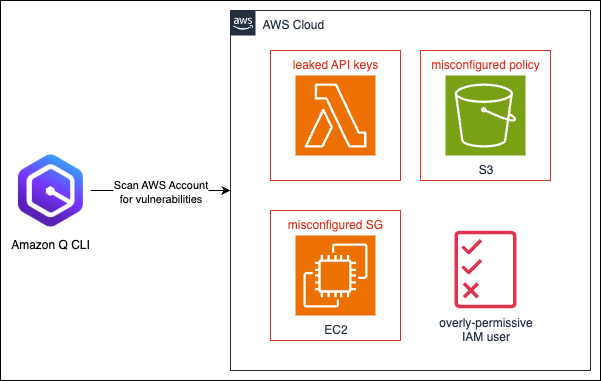

# AWS Security Demo - Amazon Q Developer CLI

## Overview

This repository contains a security demonstration environment for **Margni Innovations**, an AI-driven tech startup. The demo simulates a realistic security breach scenario where you act as a security auditor investigating vulnerabilities in a Singapore-based AWS environment.

## Demo Scenario

**You're a security auditor at Margni Innovations, an AI-driven tech startup. A recent breach attempt in your Singapore-based AWS environment threatens proprietary algorithms and user data. With management pressing for action, you're using Amazon Q Developer CLI to swiftly analyze vulnerabilities and remediate issues before further damage occurs.**

## Architecture Overview

The CloudFormation template (`cf.yaml`) provisions an intentionally vulnerable AWS environment containing:



### Intentional Vulnerabilities

This demo environment includes the following security issues for educational purposes:

1. **🔓 Misconfigured Security Group**
   - SSH (port 22) open to the entire internet (0.0.0.0/0)
   - EC2 instance exposed to potential brute force attacks

2. **🔑 Leaked API Keys in Lambda**
   - Hardcoded API key in Lambda function code
   - Exposed database passwords and JWT secrets
   - Credentials visible in CloudFormation template

3. **🪣 Misconfigured S3 Bucket**
   - Public read access enabled
   - Public bucket listing allowed
   - Versioning disabled
   - No encryption at rest

4. **👤 Overly-Permissive IAM User**
   - IAM user with full AdministratorAccess policy
   - Violates principle of least privilege

## Prerequisites

- AWS CLI configured with appropriate permissions
- Amazon Q Developer installed
- AWS account with permissions to create:
  - VPC, Subnets, Internet Gateway, Route Tables
  - EC2 instances, Security Groups
  - S3 buckets and bucket policies
  - IAM users and roles
  - Lambda functions

## ⚠️ IMPORTANT SECURITY WARNINGS

### 🚨 DO NOT USE IN PRODUCTION

**This environment contains intentional security vulnerabilities and should NEVER be deployed in a production AWS account.**

### 🛡️ Recommended Safety Measures

1. **Use a Dedicated Demo Account**: Deploy only in a separate AWS account used exclusively for security training
2. **Limit Region**: Deploy in `ap-southeast-1` (Singapore) as intended for the demo scenario
3. **Monitor Costs**: Resources include t2.nano instances to minimize costs, but monitor usage
4. **Clean Up Promptly**: Delete the stack immediately after the demo to avoid security risks
5. **Network Isolation**: Consider deploying in an isolated VPC with limited internet access

### 🔒 What Gets Created

- **VPC**: 10.0.0.0/16 with public subnet
- **EC2**: t2.nano instance with vulnerable security group
- **S3**: Publicly accessible bucket (named with account ID for uniqueness)
- **IAM**: User with administrative privileges
- **Lambda**: Function containing hardcoded API keys

## Deployment Instructions

1. **Clone the repository**:
   ```bash
   git clone <repository-url>
   cd aws-amazonq-dev-demo
   ```

2. **Deploy the CloudFormation stack**:
   ```bash
   aws cloudformation create-stack \
     --stack-name margni-security-demo \
     --template-body file://cf.yaml \
     --capabilities CAPABILITY_IAM \
     --region ap-southeast-1
   ```

3. **Wait for deployment completion**:
   ```bash
   aws cloudformation wait stack-create-complete \
     --stack-name margni-security-demo \
     --region ap-southeast-1
   ```

## Using Amazon Q Developer CLI for Security Analysis

Once deployed, use Amazon Q Developer CLI to:

1. **Scan for vulnerabilities**:
   ```bash
   q security scan
   ```

2. **Analyze specific resources**:
   ```bash
   q analyze ec2 security-groups
   q analyze s3 bucket-policies
   q analyze iam users
   ```

3. **Get remediation suggestions**:
   ```bash
   q security remediate
   ```

## Demo Walkthrough

1. **Discovery Phase**: Use Q CLI to identify the vulnerable resources
2. **Analysis Phase**: Investigate each vulnerability type
3. **Remediation Phase**: Apply Q CLI suggested fixes
4. **Verification Phase**: Confirm vulnerabilities are resolved

## Cleanup

**CRITICAL**: Always clean up after the demo:

```bash
aws cloudformation delete-stack \
  --stack-name margni-security-demo \
  --region ap-southeast-1
```

Verify deletion:
```bash
aws cloudformation wait stack-delete-complete \
  --stack-name margni-security-demo \
  --region ap-southeast-1
```

## Cost Considerations

- **EC2**: t2.nano instances (~$0.0058/hour in ap-southeast-1)
- **S3**: Minimal storage costs
- **Lambda**: Pay per invocation (likely $0 for demo)
- **Other services**: Minimal to no cost

**Estimated cost**: <$1 USD per day if left running

## Educational Objectives

After completing this demo, participants will understand:

- How to identify common AWS security misconfigurations
- Using Amazon Q Developer CLI for security analysis
- Best practices for AWS security hardening
- The importance of the principle of least privilege
- Proper secrets management in AWS

## Support

Feel free to contact me if you encountered any problems

---

**Remember**: This is a training environment with intentional vulnerabilities. Never deploy in production!
